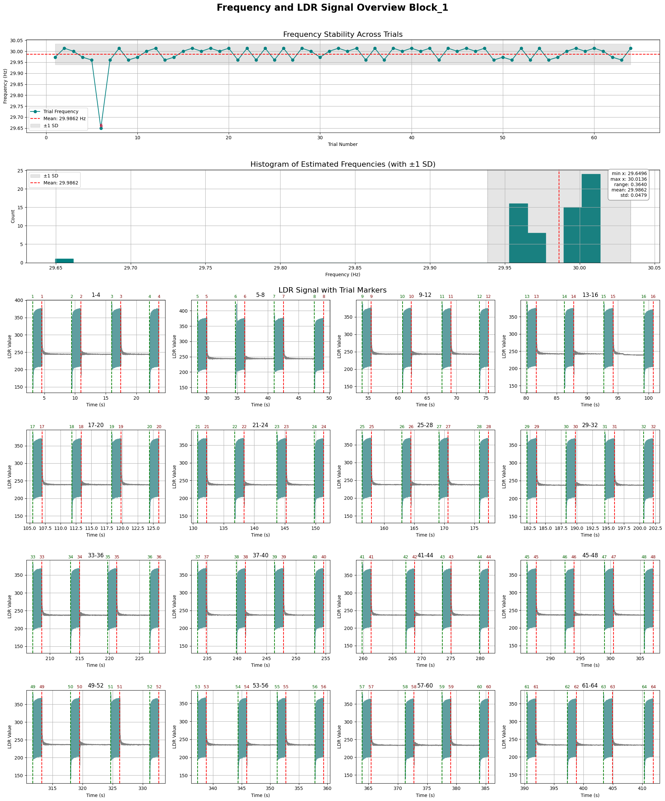

# Photocell Record for Monitor Frequency Check

This project is designed to **validate the refresh rate of a monitor** for **SSVEP (Steady-State Visual Evoked Potentials)** experiments. By using a **photocell sensor** alongside **LSL markers**, it records and analyzes the screen refresh stability.

---

## Project Structure

The project contains:
- **Arduino Sketches** for different measurement types
- **Jupyter Notebooks** for recording, processing, and visualization
- **Python Scripts** for modular processing and recording
- **Data folders** organized by subject ID

---

## Workflow Overview

### 1. Recording (`photocell_record.ipynb`)
- Records **photocell values** and **LSL markers** from MATLAB-based stimuli.
- Saves output as `.csv` in the `raw_data` folder.

### 2. Processing (`process_raw.ipynb`)
- Aligns timestamps between **LDR signals** and **LSL markers**.
- Outputs aligned data to the `process_data` folder.

### 3. Visualization (`plot.ipynb`)
- Plots and analyzes the **monitor’s frequency stability** using the processed data.

---

## Python Script Functions

### `photocell.py`
- Records:
  - Photocell sensor values
  - LSL markers
- Outputs raw `.csv` files to the `raw_data` folder

### `process_freq.py`
- Handles:
  - Preprocessing
  - Frequency computation
  - Timestamp alignment
  - Visualization utilities

---

## Folder Structure

```plaintext
photocell_arduino/
  intensity_measure/
    └── intensity_measure.ino
  screen_freq_measure/
    └── screen_freq_measure.ino

python_file/
  raw_data/
    └── sXX/
        └── sXX_block_N_raw.csv

  process_data/
    └── sXX/
        └── sXX_block_N_process.csv

  functions/
    ├── photocell.py
    └── process_freq.py

  photocell_record.ipynb
  process_raw.ipynb
  plot.ipynb
```

- `sXX`: Subject folder (e.g., `s1`, `s2`)
- `block_N`: Data file for a specific block number (e.g., `block_1`, `block_2`)

---
## Arduino Sketch Descriptions
### `intensity_measure.ino`  
- Used for **recording LDR (Light Dependent Resistor) sensor values**.
- Continuously reads **analog input** from the photocell.
- Sends raw light intensity data via **Serial output** (used by `photocell.py`).
- This sketch is essential for the **data collection phase** using `photocell_record.ipynb`.

### `screen_freq_measure.ino`  
- Detects screen refresh events (e.g., flickering) to measure refresh rate.


---

## Plot Overview (`plot.ipynb`)

The `plot.ipynb` notebook provides a comprehensive **visual overview** of the monitor refresh stability and LDR signal quality during a specific block of trials.

### Components of the Visualization

1. **Frequency Stability Across Trials (Top Line Plot)**
   - Each point represents the **estimated refresh frequency** for one trial.
   - Red dashed lines indicate:
     - Mean frequency
     - ±1 standard deviation (SD)
   - Useful for identifying **instabilities** or **anomalous trials**.

2. **Histogram of Estimated Frequencies (Middle)**
   - Distribution of trial-level frequency estimates.
   - Helps assess overall consistency.
   - Summary stats shown: min, max, mean, std, range.

3. **LDR Signal with Trial Markers (Bottom Grid of Subplots)**
   - Each subplot shows **raw LDR signal** for 4 trials.
   - Vertical dashed lines mark:
     - Trial start (green)
     - Trial end (red)
   - Highlights signal quality, latency artifacts, and SSVEP response onset.

### Interpretation Notes
- Stable flat frequency line = reliable monitor refresh
- Histogram with narrow spread = high temporal consistency
- Sudden drops in signal = possible display or sensor issue

[](plot.png)
---

